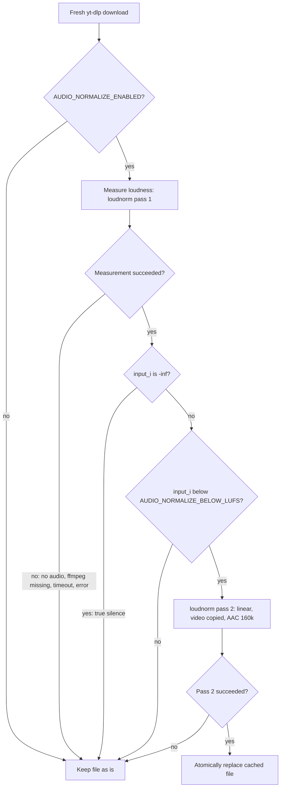

# UFB-0040. Near-silent audio normalization

**Tags:** #download #media

## User Story

As a Telegram user, I want a downloaded video whose audio is almost inaudible to be brought up to a normal loudness, so that I can hear it without cranking the volume.

## Behavior

Some videos (observed on TikTok: h264/h265, "original sound", watermarked variants, both mobile API hosts, and TikTok's own in-app "Save") carry a valid audio stream that is ~35 dB quieter than normal — e.g. −50.9 LUFS against −15 LUFS for a typical clip. The source file itself is that quiet; the TikTok app compensates on playback, a downloaded file doesn't.

With `AUDIO_NORMALIZE_ENABLED=true`, every fresh yt-dlp video download is measured, and a file whose integrated loudness is below `AUDIO_NORMALIZE_BELOW_LUFS` (default `-40`) has its audio normalized to −16 LUFS. The video stream is copied untouched. The fixed file replaces the cached one, so a later cache hit serves the normalized version. A cache hit itself is never re-measured.

| Setting                      | Default | Meaning                                                  |
|------------------------------|---------|----------------------------------------------------------|
| `AUDIO_NORMALIZE_ENABLED`    | `false` | Opt in to measuring and normalizing downloads            |
| `AUDIO_NORMALIZE_BELOW_LUFS` | `-40`   | Integrated loudness under which a file counts as too quiet |

## Implementation

- `app/media.py`: `measure_loudness()` runs `ffmpeg -af loudnorm=I=-16:TP=-1.5:LRA=11:print_format=json -f null -` and parses the JSON block from stderr. `normalize_if_quiet()` decides, then runs the second pass with the `measured_*` values and `linear=true` (constant gain rather than dynamic processing, when the measured values allow it): `-c:v copy -c:a aac -b:a 160k`. Both never raise, same shape as `probe()` ([UFB-0036](UFB-0036-native-video-replies.md)).
- The second pass writes to `<file>.loudnorm.part` and is moved over the original with `os.replace`. The `.part` suffix keeps the cache lookup ([UFB-0015](UFB-0015-yt-dlp-media-download.md)) from ever treating a half-written file as a finished download.
- `app/download.py`: `yt_dlp_download` calls it after a fresh download, not on a cache hit.
- Uses the `ffmpeg` binary already in the image.

## Quirks & Decisions

- Quirk: a file that is truly silent measures `-inf`. Nothing to amplify, so it is left alone.
  Proposed: keep skipping.
- Quirk: when the measured values don't allow `linear=true`, loudnorm silently falls back to dynamic processing, so the result is less predictable.
  Proposed: accept it; the file is still far louder than before.
- Quirk: TikTok photo-post audio ([UFB-0039](UFB-0039-tiktok-photo-galleries.md)) is a separate `.mp3` path and isn't normalized.
  Open: whether gallery audio can be near-silent too.

## Testing

### Human

- With the flag on, send the bot `https://www.tiktok.com/@kaniakoroomminimalist/video/7682574621010398472`. Measuring the cached file (`ffmpeg -i <file> -af ebur128 -f null -`) shows about −16 LUFS, with the same video codec as before.
- Send a normally loud clip. The logs show it was left alone and the file is unchanged.

### Unit

- Loudness measurement: parses the loudnorm JSON; returns `None` for a missing binary, timeout, non-zero exit, unparsable output or missing `input_i`.
- Flag off → no ffmpeg call.
- Loud file → measured once, left unchanged.
- Quiet file → second pass uses `measured_*`, `linear=true`, `-c:v copy`, `-c:a aac -b:a 160k`; the temp file replaces the original.
- `-inf` → skipped.
- Second pass fails → original kept, temp file removed, nothing raised.
- `yt_dlp_download` normalizes after a fresh download, not on a cache hit.
- Settings defaults and parsing.

## Status

Implemented
