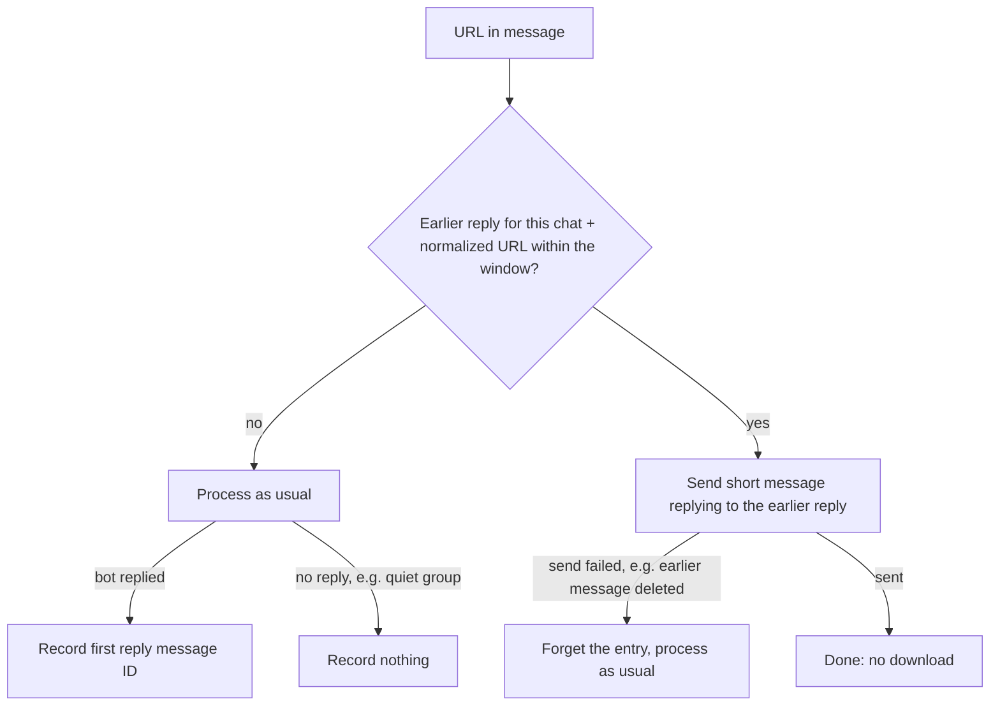

# UFB-0050. Duplicate link detection

**Tags:** #telegram #cache

## User Story

As a Telegram chat member, I want the bot to point at the earlier reply when someone posts the same link again, so that the chat isn't flooded with identical videos.

## Behavior

When the same link was already answered in this chat within `DUPLICATE_WINDOW` seconds (default 3600, `0` disables), the bot does not download or reply in full again. It sends a short "same link as above" message that replies to its earlier answer, so Telegram jumps to it.

The download cache already avoids re-downloading ([UFB-0016](UFB-0016-download-caching.md)). This feature adds the per-chat memory of which message answered which URL, and for how long.

## Implementation

- `app/duplicates.py`: one small JSON file per normalized URL at `CACHE_DIR/replies/<stem>.json`, holding `{chat_id: {message_id, at}}`. Same cache stem and atomic write as the [UFB-0041](UFB-0041-link-metadata-store.md) store, in a separate directory because the key is the URL as posted (it has no media file, so the metadata sidecar sweep would delete it).
- Normalization: lowercase scheme and host, drop the fragment, trailing slash and tracking parameters (`utm_*`, `fbclid`, `gclid`, `igshid`, `si`, `feature`).
- The handler wraps the incoming message in a recorder that captures the first reply's message ID, whatever its kind (video, gallery, text).
- The cleanup sweep removes a record once all its entries are older than the window.

## Quirks & Decisions

- Quirk: there is no memory of earlier replies. Decision: the per-chat store above; the window is one hour by default (`DUPLICATE_WINDOW`, seconds), chosen so a repeat in a live conversation is caught but an old link can be re-requested later.
- Quirk: group chats are kept quiet ([UFB-0004](UFB-0004-group-chat-quietness.md)). Decision: detection applies in groups too, since that is where repeats flood; the short message is only sent when a real reply was sent earlier, so a quiet link stays quiet.
- Quirk: the earlier reply may have been deleted. Decision: the short message is sent with `allow_sending_without_reply` off; if Telegram refuses it, the entry is dropped and the link is processed normally.
- Quirk: a repeat posted in another chat. Decision: entries are per chat; another chat gets a full reply.
- Quirk: the link text decides, not the resolved URL. Decision: two different short links to one video are not detected as duplicates; the download cache still saves the download.
- Quirk: the first reply may be a fallback text after a failed video upload. Decision: whatever message went out first is the one pointed at.

## Testing

### Human

- Post the same link twice in one chat. The second time the bot links the first reply.

### Unit

- Window expiry, `DUPLICATE_WINDOW=0` disabling, chat isolation, and URL normalization (case, fragment, slash, tracking parameters) before lookup.
- Recording and the cleanup sweep of expired records.
- The reply recorder keeps the first sent message ID, including from a media group.

### Integration

- A repeated link in the same chat gets the short reply to the earlier message and no download.
- A deleted earlier message produces a normal full reply.
- A first link with no reply (quiet group) records nothing.

## Status

Implemented
