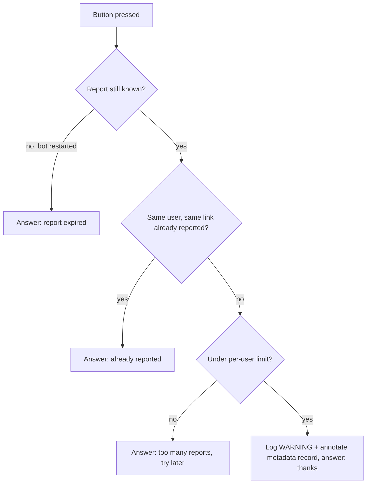

# UFB-0051. Report-broken-link button

**Tags:** #telegram #ux #ops

## User Story

As a Telegram user, I want a button on a bad reply that reports it, so that the maintainer finds out which links the bot gets wrong.

## Behavior

Only the failure replies get an inline "Report broken link" button: the mirror-link fallback and the plain "cannot download" reply ([UFB-0013](UFB-0013-download-failure-fallback.md)). Successful replies stay clean. Pressing it logs the URL, the failure reason and the platform for the maintainer, and answers the user with a short acknowledgement.

Reports are rate-limited per user (`REPORT_RATE_LIMIT` per `REPORT_RATE_WINDOW` seconds, default 3 per hour; `0` disables the limit). The same user pressing the same reply twice is acknowledged once and not logged again.

## Implementation

- `FailureReply` (a `str` subclass in `app/url_processing.py`) is what the two failure fallbacks return; it carries the URL and the reason, so every other caller still sees a plain `str`.
- `app/reports.py` holds the pure parts: callback data (`rb:<token>`, token = 16 hex of sha256 of the URL, well under Telegram's 64-byte limit), the in-memory pending table (bounded, newest 1000), the per-user rate limiter, and the recording.
- The bot attaches the keyboard to the failure reply and handles the callback (`@dp.callback_query(F.data.startswith("rb:"))`).
- Reason is the outcome label from [UFB-0045](UFB-0045-usage-metrics.md) (`failure` or `fallback_mirror`), platform is `metrics.platform_for`. This is distinct from [UFB-0054](UFB-0054-maintainer-alerts.md), which alerts on the bot's own health without any user action.
- A report is one `WARNING` log line (`Broken link report: url=... reason=... platform=...`, no user ID) and is appended to a capped `reports` list in the link's record in the metadata store ([UFB-0041](UFB-0041-link-metadata-store.md)); existing keys are kept.

## Quirks & Decisions

- Decision: the button is on fallbacks only, not all replies, to avoid clutter.
- Decision: the pending table is in memory, so a button on a pre-restart reply answers "report expired" instead of persisting every failed URL.
- Decision: reports are kept in the log (retention is the operator's log policy; readable by whoever reads the logs) and, as a convenience, in the link's metadata record. The record is swept by the cache cleanup once no media exists for the link, which for a failed link is the next sweep, so the log is the durable copy. User IDs are never logged.
- Quirk: the rate limiter is per process and resets on restart.

## Testing

### Human

- Press the button on a fallback reply. The user gets an acknowledgement and the report shows up in the log. Press on several different failed links quickly and the rate limit answers.

### Unit

- The per-user rate limiter, the callback data parsing, `FailureReply` on both fallbacks, and the keyboard on failure replies only.

### Integration

- A report from a callback is logged and stored with URL, reason and platform; duplicate, rate-limited and expired presses are answered without recording.

## Status

Implemented
