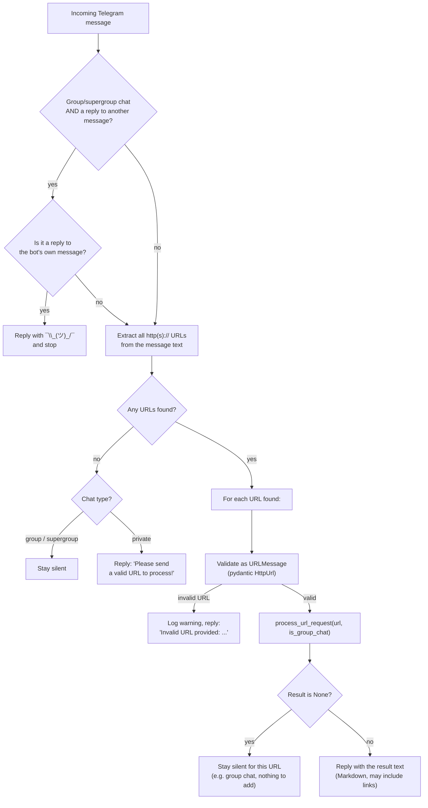
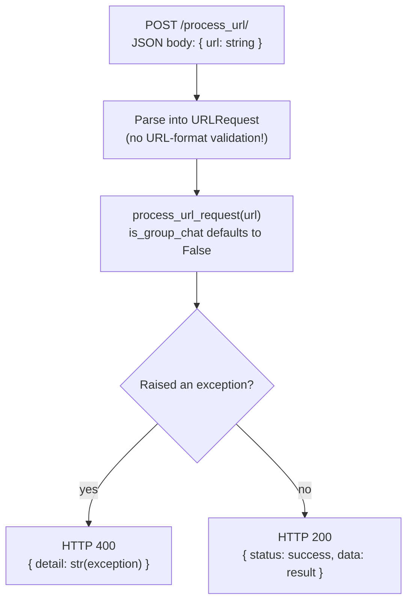

# Message Handling Flow

How an incoming Telegram message is routed through `app/bot.py`, and how a request to the
REST API (`app/api.py`) compares. Both paths converge on the same URL-processing logic —
see [`url-processing-flow.md`](./url-processing-flow.md) for what happens inside that box.

## Telegram bot: `handle_message`

## REST API: `POST /process_url/`

## Notes on the two entry points

- The bot path always validates the URL shape first (`URLMessage.url: HttpUrl`) and knows
  whether the chat is a group, which lets `process_url_request` stay silent in groups when
  there is nothing useful to add.
- The API path skips URL validation (`URLRequest.url: str`) and always behaves as if
  `is_group_chat=False`, so it never returns a silent/empty result — see
  [`BUGS.md` #12](../BUGS.md#12-unauthenticated-api-is-an-ssrf-capable-open-proxy-lowcontextual)
  for the security implication of that gap.
- Both paths call the exact same `process_url_request()` function — the "brain" of the bot is
  shared, only the transport and pre-validation differ.
