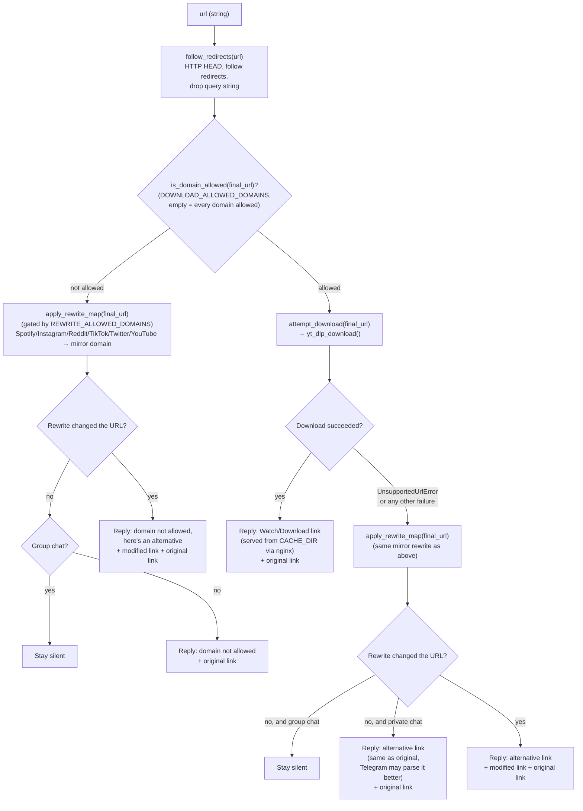

# URL Processing Flow

What happens inside `process_url_request()` (`app/url_processing.py`) once a URL has arrived
from either the Telegram bot or the REST API — see
[`message-handling-flow.md`](./message-handling-flow.md) for how it gets there.

## Step-by-step summary

1. **Resolve redirects** — `follow_redirects()` sends a `HEAD` request and follows redirects to
   get the real destination URL, stripping its query string. Falls back to the original URL on
   timeout (see [`BUGS.md` #1](../BUGS.md#1-redirect-resolution-strips-query-strings-breaking-youtube-rewrites-high)
   and [#11](../BUGS.md#11-follow_redirects-only-handles-the-timeout-case-low) for gaps here).
2. **Domain allow-list gate** — `DOWNLOAD_ALLOWED_DOMAINS` is opt-in: empty (the default) allows
   every domain to be downloaded; a non-empty list restricts downloads to only the domains
   listed. YouTube is not special-cased here — if yt-dlp supports the URL and the domain is
   allowed, the bot downloads it like any other platform, rather than mirroring it (see
   [`BUGS.md` #5](../BUGS.md#5-domain-allow-list-can-be-bypassed-or-trivially-disabled-medium)
   for allow-list matching caveats).
3. **Attempt download** — for every allowed domain, `yt_dlp_download()` tries to fetch
   and cache the media file. On success, the reply links to the cached file served over HTTP.
4. **Fallback / mirror rewrite** — a mirror link is offered whenever a download isn't attempted
   (domain excluded by `DOWNLOAD_ALLOWED_DOMAINS`) or fails (unsupported site, network error,
   yt-dlp error). `apply_rewrite_map()` rewrites Spotify/Instagram/Reddit/TikTok/Twitter/X/YouTube
   links to their configured mirror domain, gated by `REWRITE_ALLOWED_DOMAINS` (empty = every
   platform rewritten). The two allow-lists are independent: excluding a domain from one has no
   effect on the other.
5. **Group-chat quietness** — throughout, if the "alternative" link would be identical to the
   original URL (nothing useful to add) and the message came from a group chat, the bot stays
   silent instead of replying — this is what keeps the bot from being noisy in group chats
   full of ordinary links.

## Where the mirror domains come from

`apply_rewrite_map()` rewrites the URL's domain to a configurable "mirror" service (e.g.
`fxtwitter.com`, `kkinstagram.com`) that renders richer previews/embeds than the original site,
for every platform including YouTube. The domains are configurable via environment variables
(`*_MIRROR_DOMAIN` in `app/config.py`) and default to the values documented in `README.md`.
